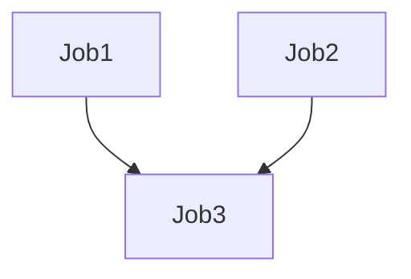

# キャッシュの依存

CircleCIでビルドを高速化するにはキャッシングがポイントになる。

しかし、CircleCI 2.0では自動的にキャッシュを利用しないようになっている。

```
    steps:
      - restore_cache:
         keys:
           - m2-{{ checksum "pom.xml" }}
           - m2- # used if checksum fails
```

こんな感じで記述することで、手動でキャッシュを利用できる。

ゼニ払えばDockerのキャッシュレイヤーを用いることもできる。
(https://circleci.com/docs/2.0/docker-layer-caching/)

# 概要
キャッシュは特定のキー配下の階層構造を持っている。
npmやgem、mavenパッケージをキャッシュすることで高速化できる

キャッシュを利用する際は、信頼性とパフォーマンスのバランスを考慮しなければいけない。

=> **初期の段階ではキャッシュは利用しないようにしておき、必要が生じた時に利用した方が良い??**

## キャッシングライブラリ
プロジェクトが依存しているライブラリをキャッシュすることが重要。


解説は
https://circleci.com/docs/2.0/language-go/
とかを読むと良い。

# Workflow内部でキャッシュに書き込む

- 単一のWorkflow内部ではJob間でキャッシュを共有可能
  - 競合状態が発生しうる事に注意
- キャッシュはバージョン管理されないので同じキーを用いると上書きされる。




上記のようなジョブ構成の場合、Job3はJob1/2のキャッシュを利用する。
下流のジョブは上流ジョブから提供されるキャッシュを利用する。


**なんかこの辺はよくわからん**

# キャッシュをレストアする
キャッシュを保存する方法を決める際、`restore_cacheステップ`で
CircleCIがリストアする対象を決める順番などを理解することが重要

- キャッシュのキーはプロジェクトで名前空間が切られていて、prefixにmatchしている。

```
    steps:
      - restore_cache:
          keys:
            # Find a cache corresponding to this specific package.json checksum
            # when this file is changed, this key will fail
            - v1-npm-deps-{{ checksum "package.json" }}
            # Find the most recent cache used from any branch
            - v1-npm-deps-
```


# キャッシュをクリアする
キャッシュをクリーンする場合は、先ほどのルールのようにネーミングの戦略にそって
設定する。


# 依存関係のキャッシングの基本的な例

```
    steps:
      - save_cache:
          key: my-cache
          paths:
            - my-file.txt
            - my-project/my-dependencies-directory
```

# keyとテンプレートの利用

テンプレートを用いてどのキャッシュを用いるかを指定できる。

|テンプレート|内容|
|---|---|
|{{ .Branch }}| 現在ビルド中のgitブランチ |
|{{ .BuildNum }}| CircleCIのビルドナンバー |
|{{ .Revision }}| 現在ビルド中のgitリビジョン　|
|{{ .Environment.variableName }}||
|{{ checksum "filename" }}| ファイル名のコンテンツのチェックサム |
|{{ epoch }}| UNIXのエポックタイム |
|{{ arch }}| OSとCPUのアーキテクチャ |

# キャッシュ保存とリストアの例

```
    docker:
      - image: customimage/ruby:2.3-node-phantomjs-0.0.1
        environment:
          RAILS_ENV: test
          RACK_ENV: test
      - image: circleci/mysql:5.6

    steps:
      - checkout
      - run: cp config/{database_circleci,database}.yml

      # Run bundler
      # Load installed gems from cache if possible, bundle install then save cache 
      # Multiple caches are used to increase the chance of a cache hit
      
      - restore_cache:
          keys:
            - gem-cache-{{ arch }}-{{ .Branch }}-{{ checksum "Gemfile.lock" }}
            - gem-cache-{{ arch }}-{{ .Branch }}
            - gem-cache
            
      - run: bundle install --path vendor/bundle
      
      - save_cache:
          key: gem-cache-{{ arch }}-{{ .Branch }}-{{ checksum "Gemfile.lock" }}
          paths:
            - vendor/bundle

      - run: bundle exec rubocop
      - run: bundle exec rake db:create db:schema:load --trace
      - run: bundle exec rake factory_girl:lint

      # Precompile assets
      # Load assets from cache if possible, precompile assets then save cache
      # Multiple caches are used to increase the chance of a cache hit
      
      - restore_cache:
          keys:
            - asset-cache-{{ arch }}-{{ .Branch }}-{{ checksum "VERSION" }}
            - asset-cache-{{ arch }}-{{ .Branch }}
            - asset-cache
            
      - run: bundle exec rake assets:precompile
      
      - save_cache:
          key: asset-cache-{{ arch }}-{{ .Branch }}-{{ checksum "VERSION" }}
          paths:
            - public/assets
            - tmp/cache/assets/sprockets
            
      - run: bundle exec rspec
      - run: bundle exec cucumber
``` 

# キャッシング戦略のトレードオフ
# ロックファイルの利用

言語依存のパッケージマネージャのロックファイルを使う

```
$ ls -laR your-deps-dir > deps_checksum
```
として、
```
{{ checksum "deps_checksum" }}
```
のではなく、
`{{ checksum "Gemfile.lock" }}`などを用いるほうがよい。


# 異なる言語のキャッシュの利用

???

# 計算コストのかかるステップのキャッシュ
処理がヘビーなステップほどキャッシュするほど効果は大きくなります。


# 全体的なまとめ

キャッシュを利用することで効率的にビルド & テストを実行できる。
必要が発生した時にキャッシュを利用することを検討しよう。